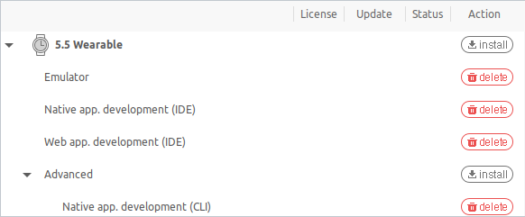
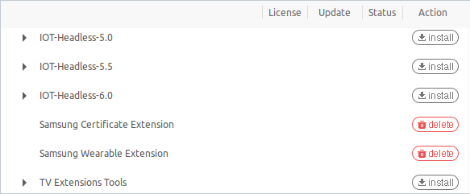

# Star Wars inspired Watch Face for Samsung Galaxy

## Supported devices

Tested on:
- Galaxy Watch 3 Titanium

[](https://www.youtube.com/watch?v=BOOvkrG0hzY "Star Wars Watch Face")

## How to build

You need the Tizen Studio IDE (I used version 4.1) or the CLI. This will assume using Tizen Studio IDE.

### Installing the IDE

Follow the installation suggestions from [Tizen Studio](https://developer.tizen.org/development/tizen-studio) page or refer to [Tizen Developer](https://developer.tizen.org/) website.  
You need a Java version 8 or above SDK.  
I installed on Ubuntu 20.10 version, which implied installing the prerequisites:
```
$ sudo apt install -y acl bridge-utils openvpn libfontconfig1 libglib2.0-0 \
    libjpeg-turbo8 libpixman-1-0 libpng16-16 libsdl1.2debian libsm6 \
    libv4l-0 libx11-xcb1 libxcb-icccm4 libxcb-image0 libxcb-randr0 \
    libxcb-render-util0 libxcb-shape0 libxcb-xfixes0 libxi6 cpio \
    rpm2cpio
$ cd ~/Downloads
$ chmod u+x web-ide_Tizen_Studio_4.1_ubuntu-64.bin
$ bash ./web-ide_Tizen_Studio_4.1_ubuntu-64.bin
```
Then follow the installer instructions.

### Adding packages

You will need to add a few packages to be able to do native wearable applications and test them on your device.  
Launch the Package Manager (it should be available from your window manager application menu).  
I have added the follwoing packages:
- In the `Main SDK` section  

- In the `Extension SDK`  


### Setting up the certificates

You will need a developer certificate for emulation, and a Samsung certificate for testing on a device. Both are free to obtain and can be created in the Certificatie Manager.  
Launch the certificate manager (it should be available from your window manager application menu).  
I then followed the instructions from [Creating certificates](https://docs.tizen.org/application/dotnet/tutorials/certificates/creating-certificates/) 
If you don't add the Samsung certificates you will not be able to follow these steps.  
I have created a Tizen profile and a Samsung profile. I enable the Tizen profile when I want to test on the emulator. I switch to the Samsung profile when I want to test on real device. You will need to create an account in Samsung (if you don't already have one) to register your certificate.

### Running the project

It is time to open Tizen Studio and import the project from the `./tizen-project` in this repo.  
You will need to copy the `tizen-manifest.xml.tpl` file ot the `tizen-project` folder and remove the `.tpl` extension. Then edit it in the IDE (visual editor is better) in order to update the application `General information` (optional but if I publish the application you might not be able to publish it too) and enter the `Author` information. 
Try and build the project, it *should* work out-of-the-box.  
Run the project. It should launch the emulator. If it doesn't go to `Tools > Emulator Manager` and create a `Wearable-5.5` emulator.

### Running on real device

In the `Certificate Manager`, switch to the Samsung profile. Then in the `tizen-project` folder, delete the following folders:
- Debug
- Release
- .sign

Then you need to connect your device. You will need to enable `Developer mode` (Google how to do it for your device) and make sure you set WiFi to `Always On`.  
Get your device IP address, then in a terminal:
```
$ <tizen-studio-folder>/tools/sdb connect <IP address>
```
It might fail due to permission. Accept the permission on your device, then run the `sdb` command again.  
Then clean the project `Project > Clean...` and `Run As > Tizen Native Application`.


Congratulations! You can now run this ... ahem ... awesome watch face :D

### Troubleshooting

I found a few times I couldn't run the application due to certificate or authorization issue. To fix that:
- check you have enabled the proper certificate (there is a tick mark next to the enabled profile)
- delete in the project directory the `Debug`, `Release` and `.sign` folders (they will be re-generated at next build)
- Right-click on the project name and `Build Signed Package`

## Customization

If you only need to update the running hands pictures, replace the 3 .png files in the project `res/images` folder. If you keep the same file names, then you're good to go. Otherwise update the filenames in the `src/jsc-sw-watch-face.c` file on lines 17-19.

The images must follow these requirements otherwise the watch hands will not follow the expected path:
- square ratio, recommended 360x360 pixels to avoid re-scaling
- the graphic representing the hand must be positioned at the 12 o'clock position
- UI recommendations is to leave a few pixels empty at the center of the image. This is because there could be a 1-2 pixel shift performed by the anti screen-burn protection and it could make the look-n-feel a bit odd.

For the application main image (the one that shows when you select the watch face), it is located in the `tizen-project/shared/res` folder. If you change it and rename it, you will need to update the `tizen-project/tizen-manifest.xml` icon value.

## References

I used this [Tizen](https://docs.tizen.org/application/native/get-started/wearable-watch/first-app-watch/) *get-started* guide to make this project. All credits goes to the original code from the templates.